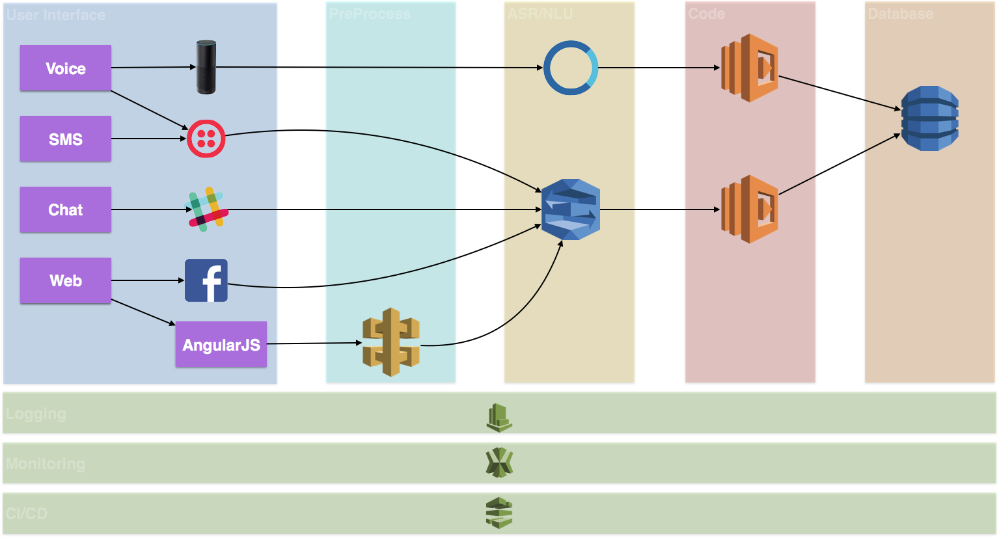

:toc:

= Build, Debug and Deploy your first Chatbot using Java

This repository explains how to create a Star Wars chatbot using Amazon Alexa and Java.

image::images/chatbot-logo.png[width="50%"]

The users can interact with this chatbot using the following means:

. Alexa
. SMS
. Facebook Messenger

Here are the key components of architecture:



== Deploy Alexa Skill and Lex bot using Java

https://github.com/arun-gupta/alexa-skill-java

```
mvn -f starwars-chatbot/pom.xml clean package install
```

Function ARN: `aws lambda get-function --function-name StarWarsChatbot --region us-east-1 | jq .Configuration.FunctionArn`

== Load Star Wars knowledge

Data is loaded as JSON documents in DynamoDB. Here is a sample JSON document:

[source, json]
----
{
  "dead": true,
  "force-sensitive": true,
  "forceside": "light",
  "id": 1,
  "lightsaber": "green",
  "planet": "Dagobah",
  "quotes": [
    "When nine hundred years old you reach, look as good you will not.",
    "Truly wonderful, the mind of a child is",
    "A Jedi uses the Force for knowledge and defense, never for attack",
    "That is why you fail.",
    "Adventure. Excitement. A Jedi craves not these things.",
    "Judge me by my size, do you?",
    "Fear is the path to the dark side",
    "Wars not make one great",
    "Do, or do not. There is no try",
    "Size matters not",
    "The dark side clouds everything",
    "Impossible to see the future is",
    "Clear your mind must be",
    "Much to learn you still have ... my old padawan"
  ],
  "weapon": "lightsaber",
  "whoami": "Yoda"
}
----

Create Global Secondary Index on `whoami`

== Integration with different platforms

=== Alexa

. Test using http://echosim.io or Alexa

=== Lex

http://docs.aws.amazon.com/lex/latest/dg/using-lambda.html

image::images/lexbot.png[width="50%"]

=== SMS

. Send a message to 408-913-9827

image::images/sms.png[width="50%"]

Details: https://docs.aws.amazon.com/lex/latest/dg/twilio-bot-association.html

=== Facebook

. Like https://www.facebook.com/Star-Wars-Chatbot-124902658243108/
. From messenger.com, send a message to this page

image::images/facebook.png[width="50%"]

Details: http://docs.aws.amazon.com/lex/latest/dg/fb-bot-association.html

=== Slack

Get yourself invited:  https://join.slack.com/t/starwarschatbot/shared_invite/MjM4OTU2MTEwMTE0LTE1MDUwOTgzMzItYzZmMjFhYTNiNA

image::images/slack.png[width="50%"]

Details: https://docs.aws.amazon.com/lex/latest/dg/slack-bot-association.html

=== Email

. https://github.com/arun-gupta/chatbot/issues/4[Jabber]

== Serverless debugging and monitoring using X-Ray

== Utterances

Use phrase `Ask Star Wars` for Alexa, otherwise just the text as is:

. what planet is {character} lightsaber
. what color is {character} ligthsaber
. Tell me a {character} quote

== Wishlist

. https://github.com/arun-gupta/chatbot/issues/2[CI/CD pipeline for Chatbot using CodePipeline]

